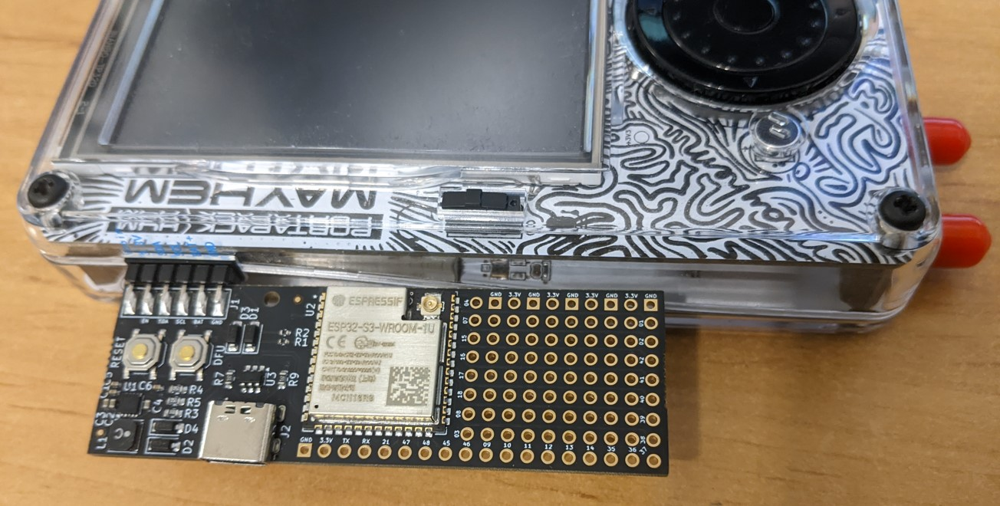
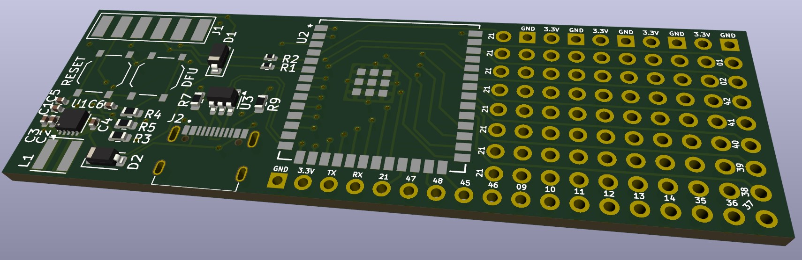
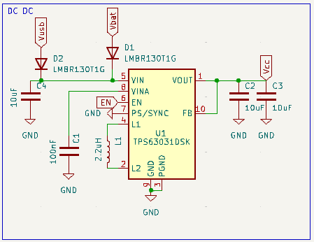
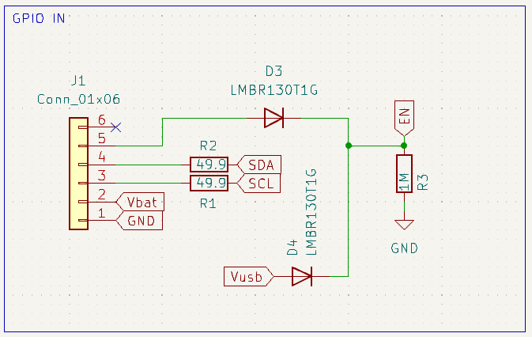
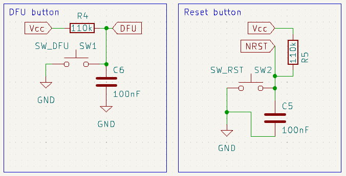
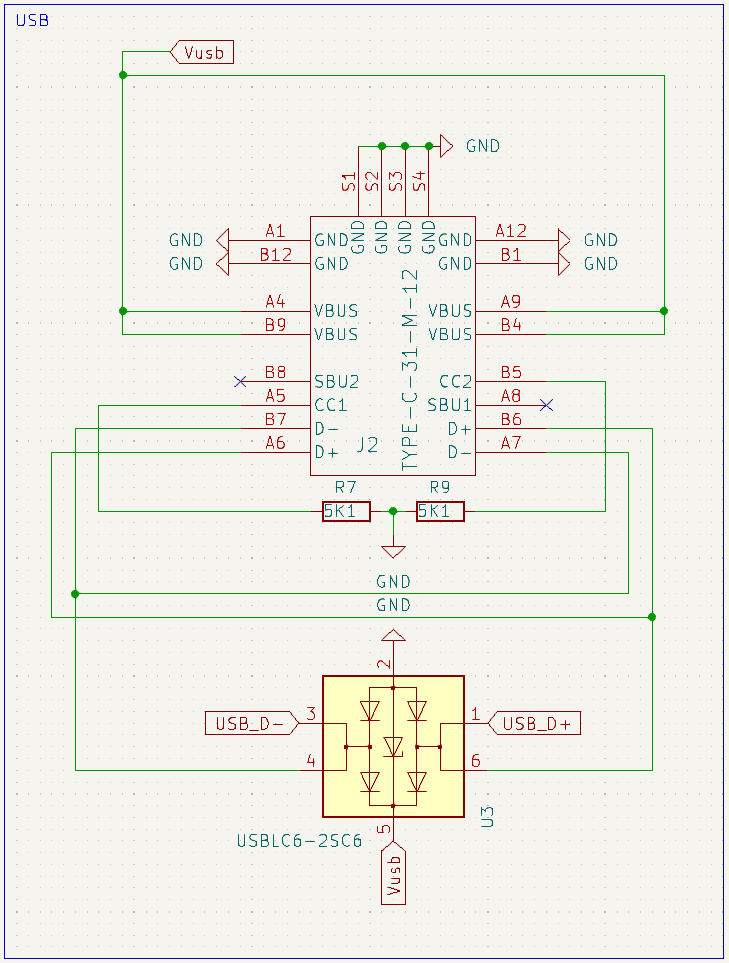
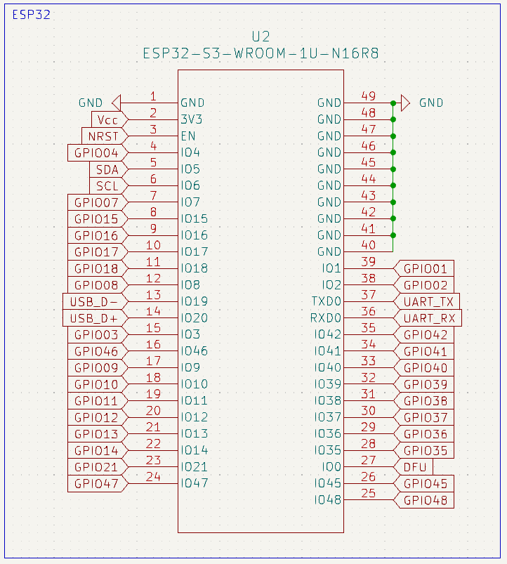
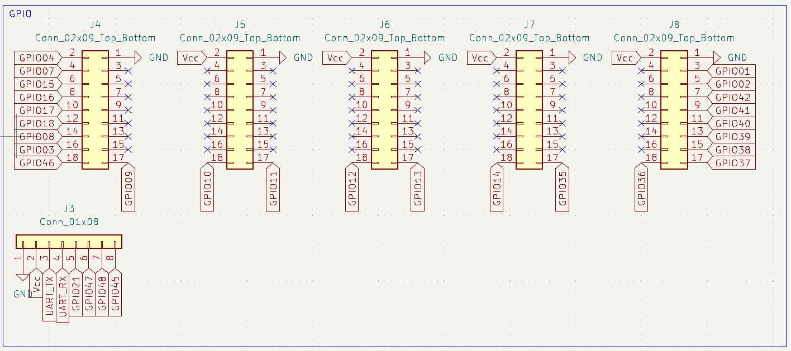
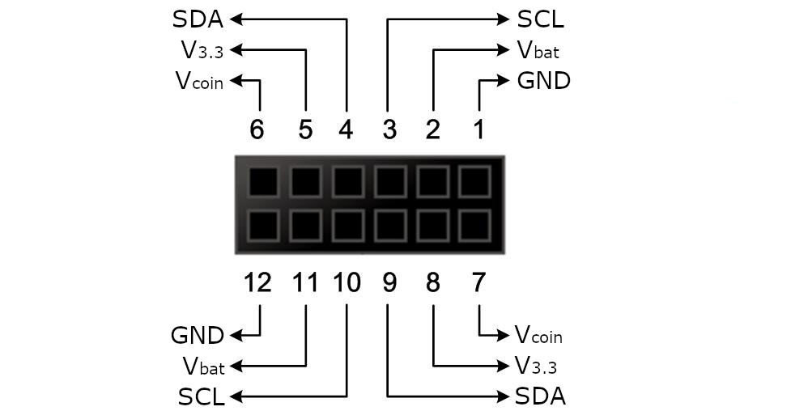

# PortaPack Mayhem External Module Developer Kit "MDK"
This is the Developer Kit External Module for the [HackRF+PortaPack H4](https://github.com/portapack-mayhem/mayhem-firmware)

## How to get the hardware
All the design files are in the pcb folder. They are set up so you can let [JLCPCB](https://jlcpcb.com/) manufacture a few boards by using the files in pcb/production.

## How to compile
The software consists of two seperate parts:
- The Standalone App that is uploaded and executed on the portapack.
  - This will be embedded in the the ESP32 firmware, so is required first.
  - The guide can be found [here](src/uart/Readme.md)
- The firmware for the ESP32-S3.
  - The guide can be found [here](src/portapack-external-module/README.md) 
  - Note: ESP-IDF version 5.4 introduced a breaking change in the I2C subsystem. So use the latest version of 5.3.

## Schematics

## Pinout

