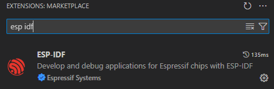
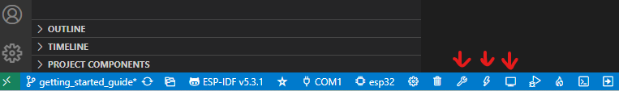

# Build and Flash using the console

Enter `idf.py -p PORT flash monitor` to build, flash and monitor the project.

(To exit the serial monitor, type ``Ctrl-]``.)

See the [Getting Started Guide](https://docs.espressif.com/projects/esp-idf/en/latest/get-started/index.html) for full steps to configure and use ESP-IDF to build projects.

# Build and Flash using vs code

- Install the ESP-IDF extension

  

- Open the folder src/portapack-external-module in vs code

- Use compile flash and monitor

  
